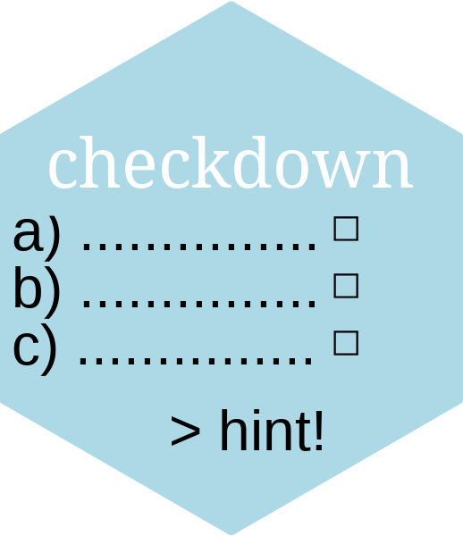

# `checkdown` 

[](http://www.repostatus.org/#active)
[](https://cran.r-project.org/package=checkdown)
[](https://CRAN.R-project.org/package=checkdown)
[](https://zenodo.org/badge/latestdoi/240126674)

G. Moroz

The main goal of this package to create checking fields and boxes in `rmarkdown`. It could be used in class, when teacher share materials and tasks (as an `.html` page or an `.html` slides), so student can solve some problems and check themselves. It is really important since some students are too shy to ask a question, so you can create tasks that will check on the fly the understanding of the class material and give some hints to those students that get stuck. In contrast to the [`learnr`](https://rstudio.github.io/learnr/index.html) package the `checkdown` package works without `shiny` and could be stored as a simple `.html` page (e. g. on Github Pages). In contrast to the [`exams`](http://www.r-exams.org/) output the `checkdown` package creates intaractive autochecking tasks. The interactive virsion of the [`exams`](http://www.r-exams.org/) output is bind to Blackboard Learn, that is really nice, but looks like an overkill for the simple task that `checkdown` solves.

See [the html demo page](https://agricolamz.github.io/checkdown/) for examples of usage.

## Installation

Get the stable version from CRAN:

```{r, eval=FALSE}
install.packages("checkdown")
```

… or get the development version from GitHub:

```{r, eval=FALSE}
install.packages("devtools")
devtools::install_github("agricolamz/checkdown")
```
